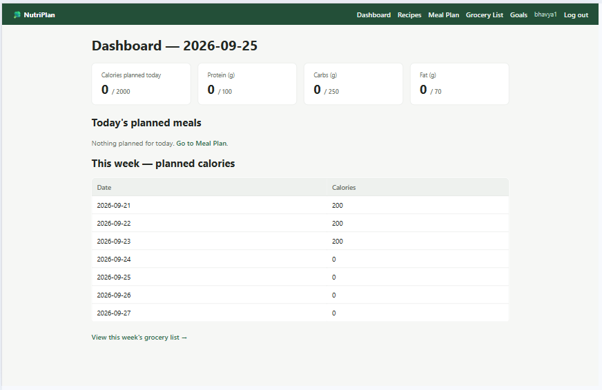

# 🥗 NutriPlan — Weekly Meal Planner & Grocery List Generator

A Flask web app for planning meals in advance and automatically generating a
shopping list from that plan — different in shape from a typical
after-the-fact calorie/food logger, where tracking is a side effect of
planning rather than the whole point of the app.



---

## 🚀 Features

- ✅ **User accounts** — register / log in / log out, with hashed passwords
  (Flask-Login + Werkzeug), each user's data fully private
- 📖 **Recipe library** — name, servings, calories/protein/carbs/fat per
  serving, and a free-text ingredient list (name, quantity, unit)
- 📅 **Weekly meal-plan grid** — assign a recipe to each day × meal-type slot
  (Breakfast/Lunch/Dinner/Snack), with previous/next week navigation
- 🛒 **Auto-generated grocery list** — aggregates ingredients across every
  recipe planned for the selected week, summing quantities when the same
  ingredient (name + unit) appears more than once, with a per-item
  "purchased" toggle that's remembered per week
- 🎯 **Goals & dashboard** — daily nutrition targets vs. today's planned
  totals, plus a 7-day planned-calorie overview
- ⚡ **Two dynamic, JavaScript-driven interactions with the backend** (see
  `static/app.js`): assigning a recipe to a meal-plan slot autosaves
  instantly via `fetch()` (`POST /api/plan/slot`), and checking off a
  grocery item toggles instantly via `fetch()` (`POST /api/grocery/toggle`)
  — neither requires a full page reload. Both fall back to plain HTML
  `<form>` submits if JavaScript is disabled, so the app is fully usable
  either way.
- 📱 **Responsive layout** — the nav, stat cards, and forms reflow to a
  single column under 640px width; the meal-plan grid scrolls horizontally
  instead of breaking.

---

## 🛠️ Tech Stack

- **Back-end:** Python 3, Flask, Flask-SQLAlchemy (SQLite, created
  automatically), Flask-Login (session-based auth, hashed passwords)
- **Front-end:** server-rendered Jinja2/HTML templates + hand-written CSS +
  vanilla JavaScript (`static/app.js`) for the two AJAX interactions above
  — no front-end framework, no build step
- **Testing:** pytest (13 automated end-to-end cases against the real Flask
  routes and a throwaway SQLite database)
- **No external APIs** — nutrition data is entered manually per recipe, so
  the app runs identically with or without internet access, one less thing
  to fail during a live demo

---

## 📦 Installation & Setup

1. Clone the repository:
   ```bash
   git clone <your-repo-url>
   cd nutriplan
   ```

2. Create and activate a virtual environment:
   ```bash
   python3 -m venv venv
   source venv/bin/activate      # on Windows: venv\Scripts\activate
   ```

3. Install dependencies:
   ```bash
   pip install -r requirements.txt
   ```

4. Run the app:
   ```bash
   python app.py
   ```

5. Visit `http://127.0.0.1:5000` in your browser.

A SQLite database file (`nutriplan.db`) is created automatically on first
run — no manual database setup or environment variables needed.

---

## 🎯 Usage

1. Register an account, then log in.
2. Go to **Recipes → Add recipe** and add 2–3 recipes, including
   ingredients in the `name, quantity, unit` format (e.g.
   `Chicken breast, 300, g`).
3. Go to **Meal Plan**, assign recipes to a few day/meal slots — each
   assignment autosaves instantly.
4. Go to **Grocery List** to see the ingredients from that week's plan
   aggregated into one shopping list. Click an item's checkbox to mark it
   purchased.
5. Check **Dashboard** for today's planned nutrition totals against your
   goals (adjustable on the **Goals** page).

---

## ✅ Test Cases

Run the full automated suite:

```bash
pip install pytest
pytest tests/ -v
```

`tests/test_app.py` runs 13 end-to-end cases against the real Flask routes
(including both AJAX API endpoints), each against a throwaway SQLite
database:

**Authentication**
- User can register and log in; a new account gets a default nutrition goal
- Duplicate usernames are rejected
- Protected routes (e.g. `/dashboard`) redirect when logged out
- User can log out

**Recipes**
- A recipe (with ingredients) can be added and edited
- Deleting a recipe already placed on the meal plan cleans up its plan
  entries instead of failing (cascading delete)

**Meal Plan**
- `POST /api/plan/slot` assigns a recipe to a slot and clears it correctly
  when unassigned
- The classic `<form>` fallback still saves a full week with JavaScript
  disabled

**Grocery List**
- Ingredient quantities are summed correctly across every recipe planned
  for the week
- `POST /api/grocery/toggle` persists the checked/unchecked state of an item

**Goals**
- Updating daily nutrition goals persists and displays correctly

All 13 cases pass (`13 passed` on the latest run).

---

## 📁 Project Structure

```
nutriplan/
├── app.py              # Flask routes (auth, recipes, plan, grocery list, goals, dashboard)
├── models.py            # SQLAlchemy models: User, Recipe, RecipeIngredient, PlanEntry, GroceryCheck, Goal
├── requirements.txt
├── templates/            # Jinja2 templates
├── static/               # style.css + app.js (the two AJAX features)
├── screenshots/          # README screenshots
└── tests/test_app.py     # pytest suite (13 cases)
```

---

## 📝 Design Note: How the Grocery List Is Built

Each time a recipe is placed on the weekly plan, its full ingredient list
(as entered for the whole recipe) is added to that week's grocery list —
the same recipe used twice in a week doubles its ingredients. This keeps
the aggregation logic simple and easy to explain, at the cost of not
scaling ingredient quantities by the number of servings actually planned.
That trade-off is a known, deliberate limitation rather than an oversight
— see the project's Phase 3 reflection for the full discussion.


